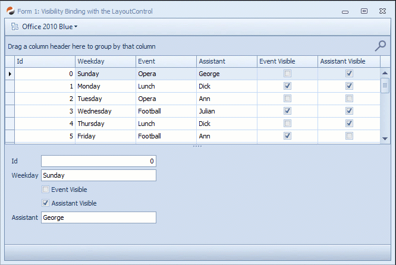
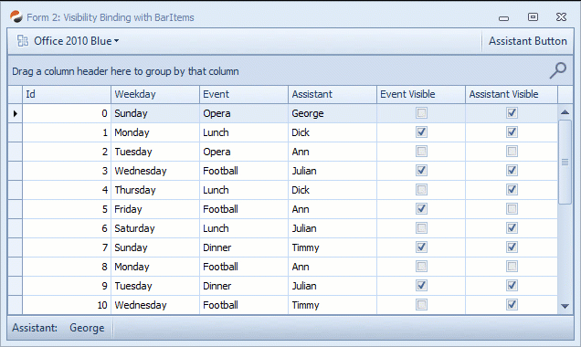

## DxUltimate Sample: VisibilityBinding - Data Binding Bool to DevExpress Visibility Properties

### 1. Introduction 

In DevExpress WinForms controls there are two major and widely used elements where the visibility is controlled by an enum property instead of a boolean value:

1. **xtraBars: All BarItems in Toolbars and all Ribbon Elements**  
  This affects all descendants of `DevExpress.XtraBars.BarItem` having a `Visibility` property of type `DevExpress.XtraBars.BarItemVisibility`.
2. **xtraLayout: All Control Elements in the LayoutControl and DataLayoutControl**  
  Affected are all descendants of `DevExpress.XtraLayout.BaseLayoutItem` having a `Visibility` property of type `DevExpress.XtraLayout.Utils.LayoutVisibility`.

### 2. The Problem

When binding to data and the visibility of certain UI elements needs to be controlled by the data, that visibility is usually indicated by boolean values - just very rarely, one would have a data model that is providing properties having those enum types.  
In turn, it is tedious and difficult to bind UI visibility states to a data model, as none of the possible options are really compelling and convenient.
The following possibilities exist:

#### a) Create a wrapper class around the data model
This would be a kind of ViewModel which wraps around the actual data classes and maps inner properties of one type to outer properties of a type that can be used for databinding: e.g. Booleans from the data model are exposed as `LayoutVisibility` properties on the outside.  
Mapping all those properties can be a huge task, which is practically not feasible wíth complex models and even worse when there's business logic and behaviour in the model that would need to be wrapped as well (even when it's just an INotifyPropertyChanged implementation).  
Well - I wouldn't want to do this just for being able to control UI visibility via data binding.

#### b) Use a TypeConverter
Another option would be to develop a TypeConverter which does the conversion between boolean and those visibility enums.  
To make this work, though, it is required to decorate the properties in the data model with an attribute to advertise that TypeConverter. This might be a good choice in some cases, but when you are developing an application with a clean model and architecture, you won't want to have those attributes on all boolean properties that might potentially needed to be used for controlling UI element visibility.  
In other cases, you might not even have access or permission to change or modify the models in that way, or the might be autogenerated, etc.

#### c) Create your custom descendants of DevExpress controls to add a boolean `Visible` property
This does work indeed, and sometimes one would wish that such property would exist out-of-the-box.  
Because: With custom components, a major part of the design experience will get lost, as those descendant components cannot be worked with during design-time. You will always need to work with the regular control versions and replace them later with your own descendant.  
This might be fine for a few single items, but with a complex layout control, this is not a straightforward task anymore. Again: not something I would want to do.

#### d) Manually handle the data binding via WinForms events
WinForms provide certain events (`Format` and `Parse`) on the data bindings which allow you to manually handle the required conversion - e.g. you receive a boolean and convert this to a visibility enum value for the one (typical read-only) direction, and the opposite for saving to the data model.
This method clearly has the lowest impact: No control descendants are required and the data model doesn't need to be touched in any way.  
But there's a drawback with this method as well: The WinForms designer doesn't provide any way to conveniently access those bindings that you create with the designer. In order to register for those formatting events, you need to either iterate over all controls and their bindings and identify those that would need that special conversion, or you create all data bindings in code. In the latter case, you'll again lose design-time convenience.
For me, that's something you could do once or twice when it's needed, but it's not a suitable way to handle data binding of DevExpress control visibility in the long run.

### 3. Solution

This example includes two WinForms Control Extender components:

- **VisibilityBinderLayout**  
  Enables visibility binding in the LayoutControls
- **VisibilityBinderBars**  
  For binding the visibility of BarItems

#### Usage

The components are ultimately simple to use

- Add the Extender Component to a form or control in the designer
- All applicable components will instantly get an additional (extension) property: `VisibilityBindToBool`
- Set this to `true`
  (it activates the auto-conversion for that component)
- Then simply bind **THE REGULAR** `Visibility` property to the boolean property in your data source

**That's all. Now you have a working boolean-to-visibility binding!**

And you haven't written a single line of code for this...

### 4. Examples

#### LayoutControl 

LayoutControlItems' visibility is bound to a boolean data property.

#### ToolBar and StatusBar

Same like above but with BarButtonItems and status bar items.

